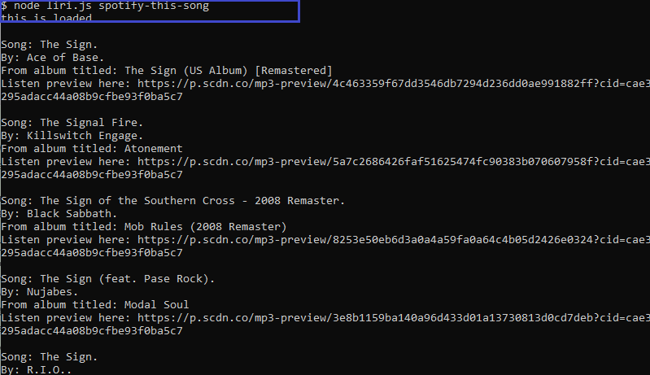
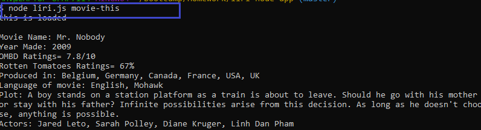
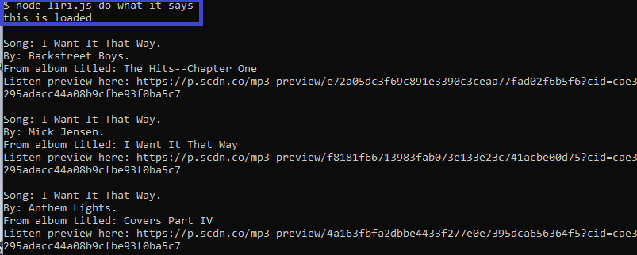
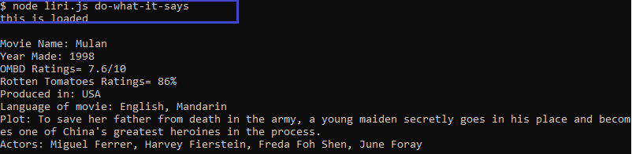

## LIRI (Language Interpretation and Recognition Interface)

This is a language interpretation application for command line on node.  This appliation will:
* Find concerts using command  _concert-this_
* Spotify a song using command  _spotify-this-song_
* Find movie information using command  _movie-this_
* Call one of the commands above using command _do-what-it-says_

## How it works:
1. Open terminal. (I am using Git Bash.)
2. Go into the folder with file liri.js.
3. Always start with "node". Then input liri.js. Stay on the same line then follow next steps.
4. Input the command and topic of interest (ex: movie-this Cinderella)
5. Results will then load. See examples below.

### Concerts 
Using _concert-this_

<b>An input of concert-this with artist or band name and the following results are loaded with Venue, Location and Date of Event</b>
 

### Spotify a song
Using _spotify-this-song_

<b>An input of spotify-this-song with song name and the results are loaded with song Title, Artist, Album name, and link to preview the song</b>
 

<b>An input of spotify-this-song with NO song name, will default to search of "The Sign".</b>
 

### Movie
Using _movie-this_

<b>An input of movie-this with movie title and the results are loaded with movie Name, Year Made, Ratings from OMBD and Rotten Tomatoes, Production location, Language of movie, and Plot.</b>
 

<b>An input of movie-this with NO movie title will default search of "Mr. Nobody".</b>
 

### Do What It Says aka "Hey Liri..."
Using _do-what-it-says_

<b>An input of do-what-it-says, which will read a text file via npm fs, will show results based on the command in the text file. In this example, the text file contains spotifty-this-song "I Want it That Way".</b>
 

<b>Here, we have an input of do-what-it-says, however, this time, the text file contatins movie-this Mulan with the results as shown.</b>
 

## Technologies Used
This application uses npm packages of axios, moment, fs, dotenv and spotify. Information on movies obtained from OMBD API. Information on concert obtained from Bands in Town Artist Events API. Song information obtained from Spotify API. This application is build with javascript and node.js. 