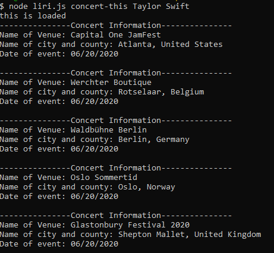

## LIRI (Language Interpretation and Recognition Interface)

This it language interpretation applicaiton for command line on node.  This appliation will:
* Find concerts using command of _concert-this_
* Spotify a song using command of _spotify-this-song_
* Find movie information using command of _movie-this_
* Call one of the commands above using command of _do-what-it-says_

## How it works:
1. Open your terminal. I am using Git Bash. 
2. Go into the folder with file liri.js.
3. Always start with "node". Then input liri.js. Stay on the same line then follow next steps.
4. Input the command based on what you are interested to look for. 
5. Information will then load. Examples below.

### Concerts 
 Running command of concert-this

Results: 

